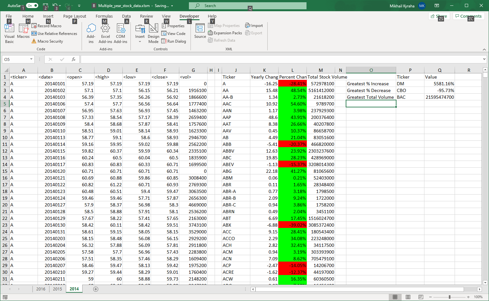
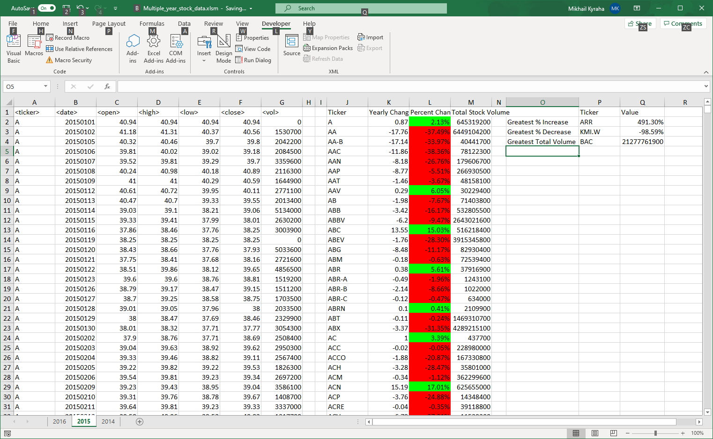
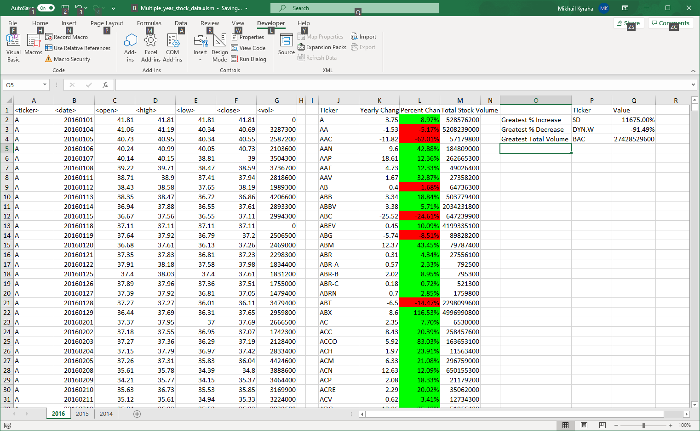

# Unit 2 | Assignment - The VBA of Wall Street

Based on the data provided in an Excel spreadsheet I ran an analysis using VBA and here are the results.

## 2014

In 2014 the most increase in the stock price was for the ticker DM. From opening in the beginning of the year to the last closing by the end of the year its price jumped whopping 5581.16%. The ticker CBO on the other hand lost 95.73% of its value for the same period. But the most volume traded however had BAC: 21,595,474,700.

## 2015

2015 wasn't that drammatic. As we can see the greatest increase was only 491.30% (ARR) and the greatest lost was 98.59% (KMI.W). By volume BAC is in the lead as usual: 21,277,761,900.

## 2016

In 2016 SD skyrocketed 11,675.00% (eleven thousand six hundred seventy five percent!). The lost record in this year belongs to DYN.W at 91.49%. The volume record keeper is still the same: BAC at 27,428,529,600

# Visual Basic for Applications code

```VB
Attribute VB_Name = "Module1"
Sub TotalVolume()
    Dim row As LongLong
    Dim ws As Object
    Dim colVolume As Integer
    Dim colTicker As Integer
    Dim colOpen As Integer
    Dim colClose As Integer
    Dim colResultTicker As Integer
    Dim colResultChange As Integer
    Dim colResultPercent As Integer
    Dim colResultVolume As Integer
    Dim rowResult As LongLong
    Dim ticker As String
    Dim opening As Double
    Dim closing As Double
    Dim change As Double
    Dim percent As Double
    Dim volume As LongLong
    Dim pColor As Long
    Dim maxChange As Double
    Dim minChange As Double
    Dim maxVolume As LongLong
    Dim maxChangeTicker As String
    Dim minChangeTicker As String
    Dim maxVolumeTicker As String
    
    colResultTicker = 10
    colResultChange = 11
    colResultPercent = 12
    colResultVolume = 13

    colTicker = 1
    colOpen = 3
    colClose = 6
    colVolume = 7

    For Each ws In Worksheets
        ws.Cells(1, colResultTicker).Value = "Ticker"
        ws.Cells(1, colResultChange).Value = "Yearly Change"
        ws.Cells(1, colResultPercent).Value = "Percent Change"
        ws.Cells(1, colResultVolume).Value = "Total Stock Volume"

        'Start populating results from row 2
        rowResult = 2
        LastRow = ws.Cells(Rows.Count, colTicker).End(xlUp).row

        'Initialize variables before start the loop
        minChange = 0
        maxChange = 0
        maxVolume = 0
        ticker = ws.Cells(2, colTicker).Value
        opening = ws.Cells(2, colOpen).Value
        volume = 0
        For row = 2 To LastRow
            If ticker = ws.Cells(row, colTicker) Then
                volume = volume + ws.Cells(row, colVolume).Value
            Else
                change = closing - opening
                'Divide by zero safety
                If opening <> 0# Then
                    percent = change / opening
                    If percent >= 0 Then
                        pColor = vbGreen
                    Else
                        pColor = vbRed
                    End If
                Else
                    percent = 0
                    pColor = vbYellow
                End If
                
                ws.Cells(rowResult, colResultTicker).Value = ticker
                ws.Cells(rowResult, colResultChange).Value = change
                ws.Cells(rowResult, colResultPercent).Value = percent
                ws.Cells(rowResult, colResultPercent).NumberFormat = "0.00%"
                ws.Cells(rowResult, colResultPercent).Interior.Color = pColor
                ws.Cells(rowResult, colResultVolume).Value = volume
                
                'Check for min & max
                If minChange > percent Then
                    minChange = percent
                    minChangeTicker = ticker
                End If
                If maxChange < percent Then
                    maxChange = percent
                    maxChangeTicker = ticker
                End If
                If maxVolume < volume Then
                    maxVolume = volume
                    maxVolumeTicker = ticker
                End If
                
                'Move things to the next ticker
                ticker = ws.Cells(row, colTicker).Value
                opening = ws.Cells(row, colOpen).Value
                rowResult = rowResult + 1
                volume = ws.Cells(row, colVolume).Value
            End If
            closing = ws.Cells(row, colClose).Value
        Next row
        
        'Output all max & min
        ws.Cells(1, 16).Value = "Ticker"
        ws.Cells(1, 17).Value = "Value"
        ws.Cells(2, 15).Value = "Greatest % Increase"
        ws.Cells(3, 15).Value = "Greatest % Decrease"
        ws.Cells(4, 15).Value = "Greatest Total Volume"
        ws.Cells(2, 16).Value = maxChangeTicker
        ws.Cells(3, 16).Value = minChangeTicker
        ws.Cells(4, 16).Value = maxVolumeTicker
        ws.Cells(2, 17).Value = maxChange
        ws.Cells(3, 17).Value = minChange
        ws.Cells(4, 17).Value = maxVolume
        ws.Cells(2, 17).NumberFormat = "0.00%"
        ws.Cells(3, 17).NumberFormat = "0.00%"
        
    Next ws
    
End Sub
```


---
Mikhail Kyraha  
Data Visualization and Analysis Bootcamp 2020